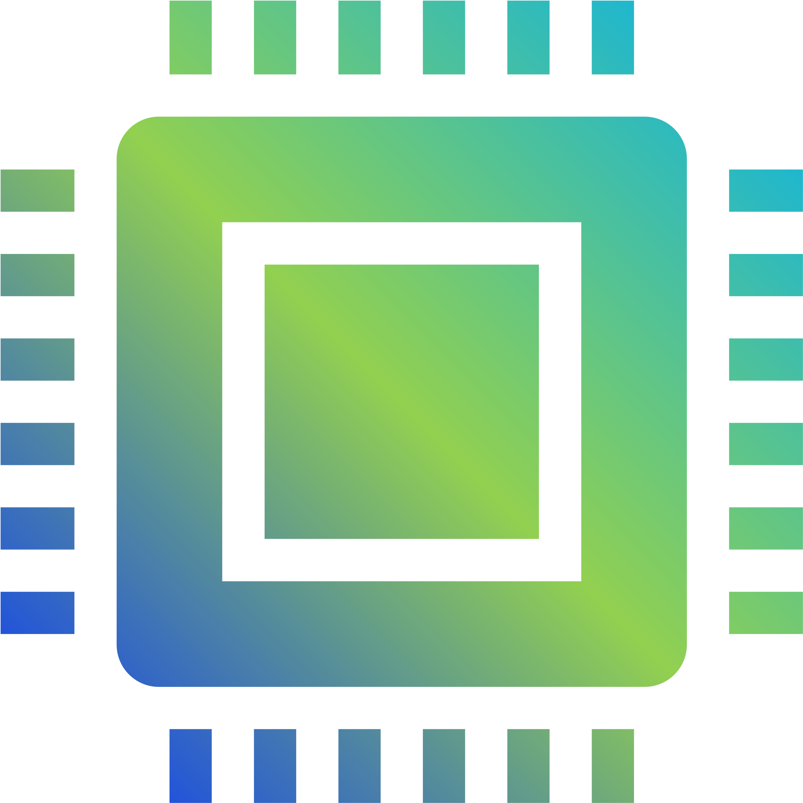

[![Contributors][contributors-shield]][contributors-url]
[![Forks][forks-shield]][forks-url]
[![Stargazers][stars-shield]][stars-url]
[![Issues][issues-shield]][issues-url]
[![MIT License][license-shield]][license-url]
[![LinkedIn][linkedin-shield]][linkedin-url]

<!-- PROJECT LOGO -->
<br />
<p align="center">
  <a href="https://github.com/theBenEdwards/NeoBot">
    
  </a>

  <h3 align="center">NeoBot</h3>

  <p align="center">
    A response and task Bot for Discord Servers!
    <br />
    <a href="https://github.com/theBenEdwards/NeoBot"><strong>Explore the code »</strong></a>
    <br />
    <br />
    <a href="https://github.com/theBenEdwards/NeoBot/issues">Report a Bug</a>
    ·
    <a href="https://github.com/TheBenEdwards/NeoBot/pulls">View Pull Requests</a>
    ·
    <a href="https://github.com/TheBenEdwards/NeoBot/network/dependencies">Dependencies</a>
  </p>
</p>

<!-- TABLE OF CONTENTS -->
<details open="open">
  <summary>Table of Contents</summary>
  <ol>
    <li>
      <a href="#about-the-project">About The Project</a>
      <ul>
        <li><a href="#built-with">Built With</a></li>
      </ul>
    </li>
    <li>
      <a href="#getting-started">Getting Started</a>
      <ul>
        <li><a href="#prerequisites">Prerequisites</a></li>
        <li>
          <a href="#environment-variables">Environment Variables</a>
          <ul>
            <li><a href="#bot_token">BOT_TOKEN</a></li>
            <li><a href="#api_key">API_KEY</a></li>
            <li><a href="#api-url">API_URL</a></li>
          </ul>
        </li>
        <li><a href="#executing">Executing</a></li>
      </ul>
    </li>
    <li>
      <a href="#usage">Usage</a>
      <ul>
        <li><a href="#permission-levels">Permission Levels</a></li>
        <li>
          <a href="#configuring">Configuring</a>
          <ul>
            <li><a href="#identifications">Identifications</a></li>
            <li><a href="#channels">Channels</a></li>
            <li><a href="#functions">Functions</a></li>
          </ul>
        </li>
        <li>
          <a href="#general-usage">General Usage</a>
          <ul>
            <li><a href="#everyone">Everyone</a></li>
            <li><a href="#member">Member</a></li>
            <li><a href="#moderator">Moderator</a></li>
            <li><a href="#admin">Administrator</a></li>
            <li><a href="#owner">Owner</a></li>
            <li><a href="#developer">Developer</a></li>
          </ul>
        </li>
        <li><a href="#error-reporting">Error Reporting</a></li>
      </ul>
    </li>
    <li><a href="#roadmap">Roadmap</a></li>
    <li><a href="#contributing">Contributing</a></li>
    <li><a href="#license">License</a></li>
    <li><a href="#the-team">The Team</a></li>
    <li><a href="#contact">Contact</a></li>
    <li><a href="#acknowledgements">Acknowledgements</a></li>
  </ol>
</details>

<!-- ABOUT THE PROJECT -->
## About The Project

Hello, and welcome to the NeoBot Discord.js project. This project has been going since 2018 when Ben, the lead developer, thought about creating his own discord bot for his discord server. Discord bots have been around for as long as we can remember, and creating our own was a fun little project. The project since then has grown into something much larger, with a whole backend API being added in version 2.0.0 to hold and process data for later use!

When the bot was in early development, there were few public repos that the author could reference on how to use certain functions, and JavaScript was a newly learnt langauge of the developer, and therefore found already exisitng bots on GitHub very useful.

Thererfore if any new Discord.js developers are looking for some easy-to-read code to follow just like we did, this repository is available for cloning in order to assist and strengthen your coding ability.

We want to do this because:
* Your time should be focused on creating something amazing, not getting stuck on issues like we did!
* Everyone struggles at first, but when we see how other people succeeded we can learn from it.
* We are grateful to the entire Discord.js community for giving us so much, and want to give a little bit back!
* Encouraging new people into Discord.js is always something good! We enjoyed it, and so can you!

Of course, there are and will always be issues with this project. Bugs and errors happen all the time, but over time more and more will be fixed. If you run into an issue, other developers have likely already found a solution to the problem! Or, if you would like to report the issue directly to us, please create a bug report by following the link above!

This is the list of dependencies and tools we used to create this project:

### Built With

* [Visual Studio Code](https://code.visualstudio.com/)
* [nodejs](https://nodejs.org/)
* [cron](https://www.npmjs.com/package/cron)
* [discord.js](https://www.npmjs.com/package/discord.js?source=post_page-----7b5fe27cb6fa----------------------)
* [dotenv](https://www.npmjs.com/package/dotenv)
* [give-me-a-joke](https://www.npmjs.com/package/give-me-a-joke)
* [imageapi.js](https://www.npmjs.com/package/imageapi.js)
* [moment](https://www.npmjs.com/package/moment)
* [node-fetch](https://www.npmjs.com/package/node-fetch)
* [Heroku](https://devcenter.heroku.com/)

<!-- GETTING STARTED -->
## Getting Started

To just 'check out' the project and see how we got the code to work, clone the repo. This will create a completely detached directory for you to do whatever you want to the code. 

* Clone the repo
```sh
git clone https://github.com/theBenEdwards/NeoBot.git
```

To create a feature, see <a href="#contributing">Contributing</a> instructions below!

### Prerequisites

Find all the advised software and packages in <a href="#built-with">Built With</a>

At the very start, you will need a code editor such as Visual Studio Code, Atom or notepad++. We advise using Visual Studio Code, but any will suffice.

For local deployment and testing, you will also want nodejs installed.

Once you have the repository saved on your machine, open a Command Line Interface and use:

* npm
  ```sh
  npm install
  ```

This will install all the necessary packages from npm.

### Environment Variables

Environment Variables are used by developers to securely store sensitive data such as BOT_TOKEN and API_KEY. These must not be released to the public and therefore must be hidden.

In order to create a version of NeoBot, you will have to substitute these variables with your own.

#### BOT_TOKEN

The BOT_TOKEN is what nodejs uses to connect your bot to discord. To create a bot token:

1. Create a new bot application at the [Discord Developer Portal](https://discord.com/developers/applications)
2. Go to 'Bot' option
3. Add a new Bot to the app
4. Click on _'Click to Reveal Token'_
5. Copy the very long token, and paste in the .env file with BOT_TOKEN

* Define like this:
```sh
BOT_TOKEN=[BOT_TOKEN_HERE]
```

This is a required step.

#### API_KEY

API_KEY is the password your API uses in the header to make sure the sender is a permitted user. 

If you do not have an API, either create arrays to subsitute for the api calls, import them and use them instead, or simply remove the API files entirely.

* Define like this:
```sh
API_KEY=[PASSWORD HERE]
```

This is an optional step.

#### API_URL

API_URL is the link to the API itself. 

Similarily to API_KEY, either create arrays to subsitute for the api calls, import them and use them instead, or simply remove the API files entirely.

* Define like this:
```sh
API_URL=[https://api-url-here/]
```

This is an optional step.

### Executing

Once all the dependencies are ready and the .env file or the arrays are set up, we can get the bot running.

* Double check npm packages are installed
```sh
npm install
```

* Then, compile and run the bot locally
```sh
node app.js
```

<!-- USAGE EXAMPLES -->
## Usage

This section is primarily meant for server owners and admins, as it covers the basics, setup and usages of the bot on a discord server.

When being added to a server through the portal, you must make sure the bot is added with the `Administrator` permissions, as if NeoBot does not have the necessary permissions, Discord will throw a DiscordApiError, which will not allow the bot to function properly. Please make sure you add permissions correctly.

### Permission Levels

NeoBot has 6 main permission levels:

* @everyone - people who do not have a role
```sh
permlvl: 0
```

* @members - members have basic access to low-tier commands
```sh
permlvl: 1
```

* @moderators - moderators have more advanced server commands
```sh
permlvl: 2
```

* @admins - admins have access to almost all commands
```sh
permlvl: 3
```

* @owners - owners have access to all commands
```sh
permlvl: 4
```

* @developers - developers have access to all commands
```sh
permlvl: 5
```

If you have feedback on which roles should have or should not have access to certain commands, please send in feedback.

### Configuring

In order to configure and activate NeoBot, when first joining the server NeoBot will ask for a `!config` command to be sent. This sets up the server on the database and allows further data to be assigned to datapoints on the database.

#### Identifications

NeoBot uses 3 main roles to communicate to - member, moderator and admin. If you do not have these roles do not worry, simply assign the already exisiting roles in your server to the roles that should have these permissions.
To set these roles or change them, follow these instructions:

1. Turn on discord dev mode (in user settings)
2. Right click on the role in role menu of the server and select `Copy ID`
3. Type `!setAdminID`/`!setModID`/`!setMemberID` followed by the role ID you have copied
4. The result should look something like this:
```
!setAdminID 1234567890
```
5. If this does not work, try setting it again.
6. For changing the ID follow steps 1-5 again.

#### Channels

NeoBot uses 6 main channels to communicate to - welcome, mod, general, memes, game and update channels. These are used by various functions and need to be logged for a function to work correctly. Not all channels need to be used, but if you dont set them you might not see some functionality work.
To set these channels or to change them, follow these instructions:

1. Turn on discord dev mode (in user settings)
2. Right click on the channel select `Copy ID`
3. Type `!setWelcomeChannel`/`!setModChannel`/`!setGeneralChannel`/`!setMemesChannel`/`!setGameChannel`/`!setUpdateChannel` followed by the channel ID you have copied
4. The result should look something like this:
```
!setWelcomeChannel 1234567890
```
5. If this does not work, try setting it again.
6. For changing the ID follow steps 1-5 again.

#### Functions

NeoBot uses 4 main functions - birthdays, calendar, polls and weeklyMemes. These are mostly automated and rely on other data within the database, however as server Admins/Owners you can enable or disable these functions
To enable/disable these functions, follow these instructions:

1. Type `!toggleBirthdays`/`!toggleCalendar`/`!togglePolls`/`!toggleWeeklyMemes`
2. This should enable/disable the setting you wish to toggle.
4. The result should look something like this:
```
!toggleBirthdays
```
5. If this does not work, try step 1 again.

Birthdays, calendars, polls and weelyMemes all operate the [cron](https://www.npmjs.com/package/cron) package, which allows for these to be scripted to appear ar certain times. When the NeoBot is started, the onReady() event runs the initial cron, which loads all the scripted events. This means that if a new event is added, it will not be added to the cron list until the bot has been redeployed. Heroku fixes this, as every 24 hours it restarts all dynos, resulting in the app being redpolyed.
Therefore, for safety, all events should be added at least 2 days before the event day actually occurs, as the cron package will then recieve the new event.

### General Usage

NeoBot has many commands. This list will break down what types of users can use what commands, judging by which role a user has. Commands are usable by users with the respective level, and users with a higher permission level can also access the command.

#### Everyone

* When first joining a server, a user can be displayed with a T&C's and can use !accept to assign themselves the role of 'Member'.
```
!accept
```

* A quick test to see if NeoBot is active.
```
!test
```

#### Member

* Show all the commands below permission level 3 with some helpful tips.
```
!help
```

* Show an automated joke.
```
!joke
```

* Show all the updates and changes NeoBot has gone through.
```
!log
```

#### Moderator

* Shows more help for channel setups.
```
!helpChannels
```

* Shows more help for Event setups.
```
!helpEvents
```

* Shows more help for Role setups.
```
!helpRoles
```

* Sends a message to the developers with any feedback. Usable outside servers as well.
```
!report
```

#### Administrator - Level 3

Administrators have many commands, and is broken down into several sections, as they make use of many server commands.

##### General

* Delete a certain amount of messages.
```
!purge
```

* Configure your server, see the status of your settings.
```
!config
```

##### Birthday

* Add a birthday to your server.
```
!birthdayAdd
```

* Show all birthdays on your server.
```
!birthdayAll
```

* Delete a birthday from your server.
```
!birthdayDelete
```

* Update a birthday on your server.
```
!birthdayUpdate
```

* View a single birthday on your server.
```
!birthdayView
```

##### Roles

* Set the Admin ID for your server.
```
!setAdminID
```

* Set the Moderator ID for your server.
```
!setModID
```

* Set the Member ID for your server.
```
!setMemberID
```

##### Channels

* Set the General Channel for your server.
```
!setGeneralChannel
```

* Set the Moderator Channel for your server.
```
!setModChannel
```

* Set the Memes Channel for your server.
```
!setMemesChannel
```

* Set the Game Channel for your server.
```
!setGameChannel
```

* Set the Update Channel for your server.
```
!setUpdateChannel
```

##### Functions

* Toggle Birthday alerts.
```
!toggleBirthdays
```

* Toggle Calendar alerts.
```
!toggleCalendar
```

* Toggle Game Polls.
```
!togglePolls
```

* Toggle Weekly Memes.
```
!toggleWeeklyMemes
```

#### Owner - Level 4

Owners have access to all previous levels, and should be treated as admin-level users

#### Developer - Level 5

Developers have access to specific commands used by functions that are active accross all servers. This means that these need to be locked down more tightly than the other functions. If a user would like to add to these functions, please use either !report on Discord or try adding an issue above.

Developers have many commands, and is broken down into several sections, as they make use of many NeoBot commands.

##### Calendar

* Add a calendar to the database.
```
!calendarAdd
```

* See all calendars on the database.
```
!calendarAll
```

* Delete a calendar from the database.
```
!calendarDelete
```

* View a calendar on the database.
```
!calendarView
```

##### Game

* Add a game to the database.
```
!gameAdd
```

* See all games on the database.
```
!gameAll
```

* Delete a game from the database.
```
!gameDelete
```

* Update a game on the database.
```
!gameUpdate
```

* View a game on the database.
```
!gameView
```

##### Subreddit

* Add a subreddit to the database.
```
!subredditAdd
```

* See all subreddits on the database.
```
!subredditAll
```

* Delete a subreddit from the database.
```
!subredditDelete
```

* View a subreddit on the database.
```
!subredditView
```

### Error Reporting

If you encounter any issues while using this bot either on Discord or while trying to run the bot yourself, please either use !report on Discord, or report an issue here: [Issues](https://github.com/TheBenEdwards/NeoBot/issues) (Requires a GitHub Account).

_When submitting a report, please try to add a 'how to replicate' section on how the team can try to fix the issue._
_Fake or false reports will be ignored, so only genuine tickets will be reviewed._

<!-- ROADMAP -->
## Roadmap

See the [open issues](https://github.com/theBenEdwards/NeoBot/issues) for a list of proposed features (and known issues).

<!-- CONTRIBUTING -->
## Contributing

Contributions are what make the open source community such an amazing place to be learn, inspire, and create. Any contributions you make are **greatly appreciated**.

1. Fork the Project
2. Create your Feature Branch (`git checkout -b feature/AmazingFeature`)
3. Commit your Changes (`git commit -m 'Add some AmazingFeature'`)
4. Push to the Branch (`git push origin feature/AmazingFeature`)
5. Open a Pull Request

Always start the branch with `feature`. If not, the Pull Request will be ignored.

<!-- LICENSE -->
## License

Distributed under the MIT License. See `LICENSE` for more information.

<!-- THE TEAM -->
## The Team

Lead Programmer - Ben Edwards

<!-- CONTACT -->
## Contact

Discord Bot: [top.gg](https://top.gg/)

Twitter - [Ben Edwards](https://twitter.com/Edwards_Ben60)

GitHub: [NeoBot](https://github.com/TheBenEdwards/NeoBot)

<!-- ACKNOWLEDGEMENTS -->
## Acknowledgements
* [An Idiots Guide](https://www.youtube.com/playlist?list=PLR2_rarYLHfg6ZJqq0WTMmI9uLcd7_GRO)
* [Discord.js](https://discord.js.org/)
* [GitHub](https://github.com/)
* [Heroku](https://devcenter.heroku.com/)
* [Img Shields](https://shields.io)

<!-- MARKDOWN LINKS & IMAGES -->
[contributors-shield]: https://img.shields.io/github/contributors/theBenEdwards/NeoBot.svg?style=for-the-badge
[contributors-url]: https://github.com/theBenEdwards/NeoBot/graphs/contributors
[forks-shield]: https://img.shields.io/github/forks/theBenEdwards/NeoBot.svg?style=for-the-badge
[forks-url]: https://github.com/theBenEdwards/NeoBot/network/members
[stars-shield]: https://img.shields.io/github/stars/theBenEdwards/NeoBot.svg?style=for-the-badge
[stars-url]: https://github.com/theBenEdwards/NeoBot/stargazers
[issues-shield]: https://img.shields.io/github/issues/theBenEdwards/NeoBot.svg?style=for-the-badge
[issues-url]: https://github.com/theBenEdwards/NeoBot/issues
[license-shield]: https://img.shields.io/github/license/theBenEdwards/NeoBot.svg?style=for-the-badge
[license-url]: https://github.com/theBenEdwards/NeoBot/blob/main/LICENSE.txt
[linkedin-shield]: https://img.shields.io/badge/-LinkedIn-black.svg?style=for-the-badge&logo=linkedin&colorB=555
[linkedin-url]: https://linkedin.com/in/benjamin-edwards-75b87a196